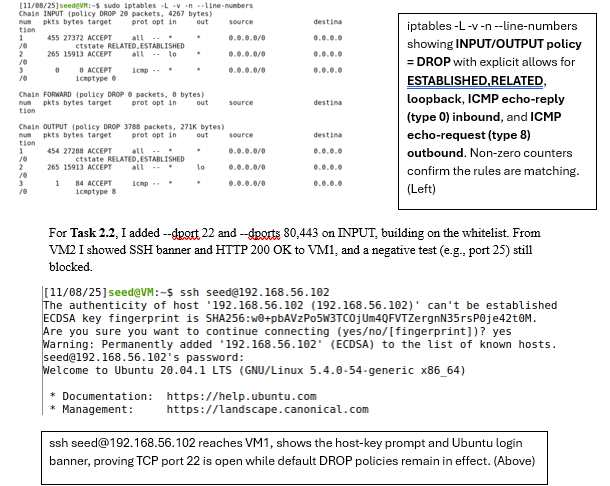
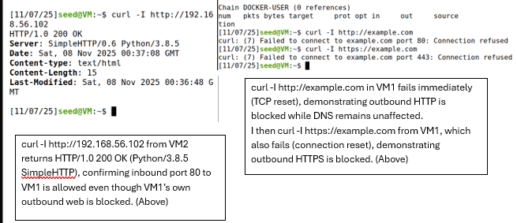
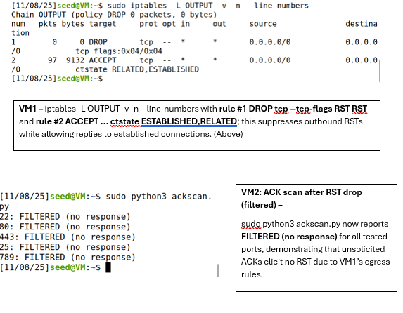
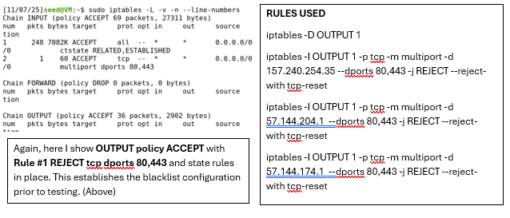

# Blacklist vs Whitelist Firewall Policies

## Objective
Demonstrate the behavioral differences between blacklist-based and whitelist-based firewall policies on a Linux system using iptables.

## Environment
- Two Linux virtual machines (VM1: firewall/target, VM2: tester)
- Network modes: NAT and Host-Only
- Tools: iptables, curl, ping

## Configuration
This lab tested both approaches:

### Blacklist Policy
- Default policies: INPUT ACCEPT, OUTPUT ACCEPT
- Explicit REJECT rules for outbound HTTP/HTTPS traffic
- Inbound web service allowed

### Whitelist Policy
- Default policies: INPUT DROP, OUTPUT DROP
- Explicit allows for:
  - ESTABLISHED,RELATED traffic
  - Loopback
  - ICMP echo-request/echo-reply
  - Selected TCP ports (SSH, HTTP/HTTPS)

## Verification

### Blacklist Policy

The firewall was configured with default ACCEPT policies and explicit REJECT rules for outbound HTTP and HTTPS traffic. This confirms a blacklist model where traffic is allowed unless specifically denied.

Outbound HTTP and HTTPS requests from the firewall VM failed immediately with TCP resets, confirming that the blacklist rules were enforced while DNS resolution remained unaffected.

Inbound HTTP requests from a second VM succeeded, demonstrating that inbound services remained accessible even while outbound web traffic was blocked.

### Whitelist Policy

The firewall was reconfigured with default DROP policies and explicit allow rules for ESTABLISHED connections and required protocols. Only traffic explicitly permitted by the rules was able to pass, demonstrating a least-privilege whitelist model.

## Key Takeaways
- Blacklist policies are easier to configure but risk unintended exposure
- Whitelist policies enforce least privilege but require careful planning
- Default DROP policies significantly reduce attack surface

