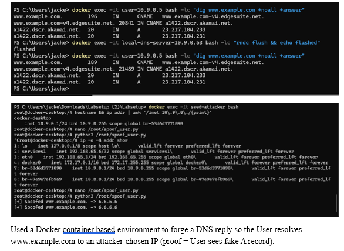
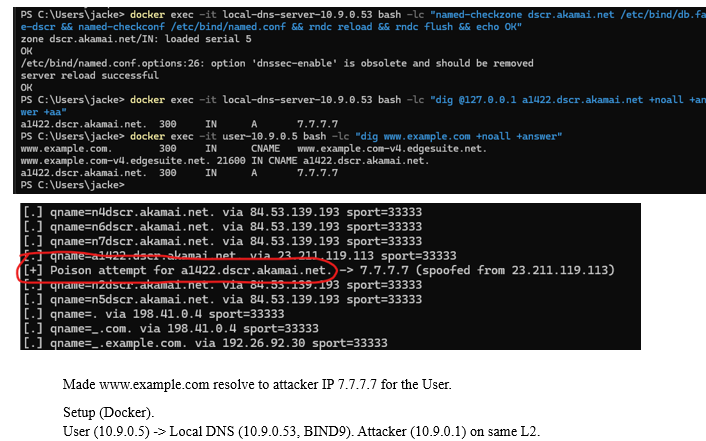
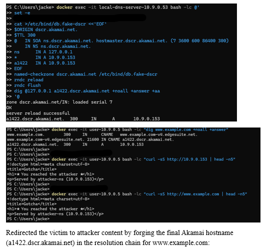
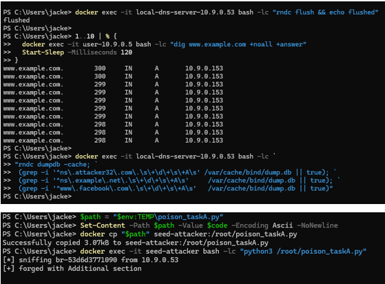

# DNS Spoofing and Cache Poisoning

This lab demonstrates how DNS responses can be spoofed and manipulated to redirect a victim to attacker-controlled infrastructure. Using a Docker-based test environment, I examined how resolvers accept forged replies, how race conditions affect DNS resolution, and how modern defenses limit cache poisoning.

## Environment
- Docker-based network testbed
- User container (victim)
- Local DNS resolver (BIND9)
- Attacker container with packet forging tools
- Tools: dig, Scapy, tcpdump, BIND utilities

## Attacks Demonstrated
- Forged DNS replies racing legitimate responses
- DNS cache poisoning of A records
- Abuse of CNAME chains (Akamai example)
- Local authoritative zone override
- Limitations imposed by bailiwick rules

## Key Observations
- The resolver accepts the first valid response matching the query tuple
- Poisoning is more reliable when the attacker controls or overrides authority
- Out-of-bailiwick records in the Additional section are discarded
- Modern resolver behavior significantly limits blind cache poisoning

## Security Implications
These attacks demonstrate why DNSSEC, restricted resolver configuration, and network segmentation are critical for protecting name resolution infrastructure.

## Verification

The user accepted a forged DNS response that arrived before the legitimate reply, resolving the domain to an attacker-controlled IP.

By configuring the local resolver as authoritative for the target zone, poisoning became deterministic rather than probabilistic.

The resolution chain terminated at an attacker-controlled host due to the poisoned authoritative response.

Out-of-bailiwick records placed in the Additional section were not cached, demonstrating modern resolver defenses.
