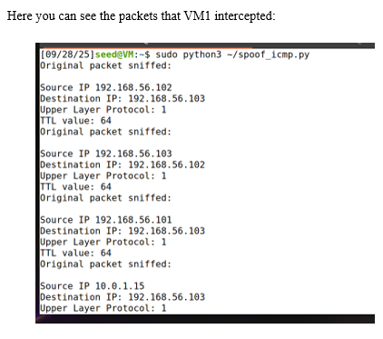
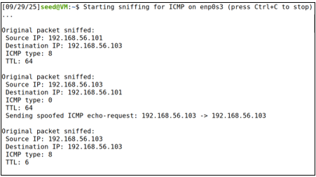
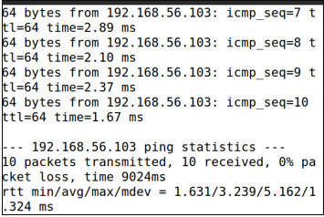

# ICMP Packet Injection

This lab demonstrates how ICMP packets can be forged and injected into a network using Python and Scapy. By crafting spoofed ICMP echo requests, I observed how a target host processes packets that appear to originate from a trusted source.

## Environment
- Two Linux virtual machines
  - Attacker VM
  - Victim VM
- Network mode: Host-only
- Tools: Python, Scapy, tcpdump

## Attack Overview
- Crafted ICMP echo-request packets with a spoofed source IP
- Injected packets directly onto the network
- Verified whether the victim responded to the spoofed sender
- Observed traffic at both the attacker and victim

The attacker intercepted ICMP traffic on the network and injected a forged ICMP echo-request packet using Scapy. The packet was crafted with a spoofed source IP to impersonate another host on the subnet.

Packet capture on the victim confirmed receipt of the forged ICMP echo-request. The source IP observed by the victim matched the spoofed address rather than the attacker’s real IP.

The victim responded to the spoofed echo-request with an ICMP echo-reply directed at the forged source address, demonstrating that ICMP does not authenticate packet origin.
Once that’s in, do not touch this lab again. It’s done.

## Verification
Packet injection was verified by:
- Capturing traffic with tcpdump on the victim
- Confirming ICMP echo requests arrived with a forged source IP
- Observing ICMP echo replies sent to the spoofed address

## Key Takeaways
- ICMP does not provide authentication of packet origin
- Hosts respond to ICMP requests based solely on packet contents
- Packet injection can be used to manipulate network behavior if filtering is absent

